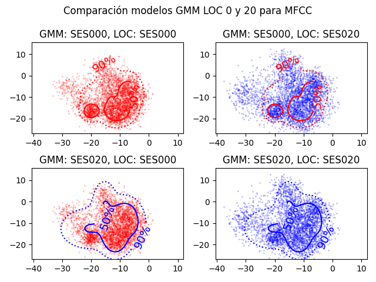

PAV - P4: reconocimiento y verificación del locutor
===================================================

Obtenga su copia del repositorio de la práctica accediendo a [Práctica 4](https://github.com/albino-pav/P4)
y pulsando sobre el botón `Fork` situado en la esquina superior derecha. A continuación, siga las
instrucciones de la [Práctica 2](https://github.com/albino-pav/P2) para crear una rama con el apellido de
los integrantes del grupo de prácticas, dar de alta al resto de integrantes como colaboradores del proyecto
y crear la copias locales del repositorio.

También debe descomprimir, en el directorio `PAV/P4`, el fichero [db_8mu.tgz](https://atenea.upc.edu/mod/resource/view.php?id=3654387?forcedownload=1)
con la base de datos oral que se utilizará en la parte experimental de la práctica.

Como entrega deberá realizar un *pull request* con el contenido de su copia del repositorio. Recuerde
que los ficheros entregados deberán estar en condiciones de ser ejecutados con sólo ejecutar:

~~~~~~~~~~~~~~~~~~~~~~~~~~~~~~~~~~~~~~~~~~~~~~~~~~~~~.sh
  make release
  run_spkid mfcc train test classerr verify verifyerr
~~~~~~~~~~~~~~~~~~~~~~~~~~~~~~~~~~~~~~~~~~~~~~~~~~~~~

Recuerde que, además de los trabajos indicados en esta parte básica, también deberá realizar un proyecto
de ampliación, del cual deberá subir una memoria explicativa a Atenea y los ficheros correspondientes al
repositorio de la práctica.

A modo de memoria de la parte básica, complete, en este mismo documento y usando el formato *markdown*, los
ejercicios indicados.

## Ejercicios.

### SPTK, Sox y los scripts de extracción de características.

- Analice el script `wav2lp.sh` y explique la misión de los distintos comandos involucrados en el *pipeline*
  principal (`sox`, `$X2X`, `$FRAME`, `$WINDOW` y `$LPC`). Explique el significado de cada una de las 
  opciones empleadas y de sus valores.

  En total hay el empleo de 5 comandos distintos, tal y como nos dice este enunciado, cada uno con opciones o argumentos distintos, así que vamos a desglosarlo todo por completo para poder entenderlo bien. En concreto solo hay un comando que es separado del programa principal de procesado de la señal (`SPTK`) que es el primero (`sox`):

  Veamos rápidamente el pipeline de comandos que se va a tratar:

  ```shell
  # Main command for feature extration
  sox $inputfile -t raw -e signed -b 16 - | $X2X +sf | $FRAME -l 240 -p 80 | $WINDOW -l 240 -L 240 |
	$LPC -l 240 -m $lpc_order > $base.lp || exit 1
  ```

  donde las variables tienen la siguiente pre-declaración en el mismo script, claro:

  ```shell
  X2X="x2x"
  FRAME="frame"
  WINDOW="window"
  LPC="lpc"
  ```

  * `sox`

    * Usamos `sox` para convertir el fichero de audio en formato *raw* con codificación de *signed integer* también definiendo la cantidad de bits usados en la codificación (de *signed integer*) por cada muestra (16). La "raya" final **-** significa que queremos redireccionar la salida del programa para otro sitio que no sea el típico stdout.

  * `x2x`

    * Ahora de entrada tenemos las muestras de audio en formato *raw* codificados como *signed integer* con 16 bits (2 bytes) por lo tanto ahora queremos transformar estos datos en tipos *float* (4 bytes). Esto lo indicamos mediante el argumento de `+sf`, donde `+` significa que estamos especificando el formato de las muestras de entrada, seguido por el format en sí (tipo short que es de 2 bytes, es decir, 16 bits), seguido por `f`, es decir, el formato en el que queremos convertir estos "shorts", que es en formato float (4 bytes cada uno). A continuación vemos un ejemplo de uso del mismo manual de referencia del software **SPTK** que nos dió una mejor idea del significado de estos argumentos:

    

  * `frame`
    * Este comando de nuevo es otro de la librería del **SPTK**. Su función es la de ingerir como entrada un seguido de muestras (el señal) y las convierte en tramas de longitud dada por la opción `-l` (en nuestro caso es 240 muestras) y de periodicidad dada por la otra opción `-p` (en nuestro caso es 80). Esto quiere decir que de toda la secuencia de muestras de señal de entrada (los floats de salida del comando **x2x**) se enventanan, inicialmente, 240 muestras, se envian como un grupo conjunto de datos, luego la ventana se desplaza por `-p`, es decir 80 en nuestro caso, y así sucesivamente, la ventana se va desplazando. Esto quiere decir que ventanas consecutivas tendran 240 - 80 muestras iguales, debido al solapamiento entre dichas tramas/ventanas.

    Tampoco olvidar que dichos números los podemos traduciar a su equivalente "analógico", ya que sí sabemos que estamos trabajando con frecuencia de muestreo de 8 kHz (periodo T = 0,125 us), tenemos tramas de duración 240 * 0,125 = **30 ms** con desplazamientos de 80 * 0,125 us = **10 ms**.

    A continuación vemos un ejemplo de uso de este comando, extraído directamente del manual de referencia oficial, donde la señal de entrada tiene **T** muestras, y generamos tramas de longitud **L** con periodicidad **P** (solapamiento de **L-P** muestras):

    

  * `window`

    *  Este comando se usa para filtrar las tramas obtenidas con el comando anterior. Teniendo en cuenta que ahora tenemos multiples tramas de longitud **L**, y sabiendo que la ventana de filtrado por defecto es la **Blackman**, multiplicamos cada trama (de longitud indicaca por la opción `-l`, que es 240) por una ventada de dicho tipo de la misma longitud (indicado por el valor de la opción `-L`, que es 240 otra vez). Si jamás ubiese distintos valores de `-l` o `-L`, se aplicaria padding sin problema alguno.

    Una vez este procesado se ha aplicado, llegamos al último comando del pipeline (o penúltimo, si consideras la redirección a fichero modificado como paso esencial).

  * `lpc`

    * En el manual de referencia, se dice que este comando realiza análisis **LPC** mediante el algoritmo de optimización de computación `Levinson-Durbin`. Tenemos indicado dos opciones, la primera, `-l`, indica la longitud de cada trama de entrada (que volvemos a poner a 240) y la segunda opción, `-m`, indica el orden del filtro LPC. El valor de esta opción es decidido por el mismo usuario, pasando el valor como primer argumento del script de llamada

    ```shell
    lpc_order=$1
    ```
    Finalmente la ejecución finaliza, si todo ha ido bien, escribiendo dichos valores de los coeficientes de LP (junto con el valor de la ganancia de predicción).

- Explique el procedimiento seguido para obtener un fichero de formato *fmatrix* a partir de los ficheros de
  salida de SPTK (líneas 45 a 51 del script `wav2lp.sh`).

  Ya se han tratado las líneas 45-46 en la pregunta anterior, por lo tanto ahora vamos a discutir las líneas 50-51, donde escribimos y realizamos el "esqueleto" del fichero fmatrix (que se acaba construyendo en las últimos líneas posteriores).

  ```shell
  # Our array files need a header with the number of cols and rows:
  ncol=$((lpc_order+1)) # lpc p =>  (gain a1 a2 ... ap) 
  nrow=`$X2X +fa < $base.lp | wc -l | perl -ne 'print $_/'$ncol', "\n";'`
  ```

  Estos comandos shell simplemente cogen toda la información del fichero `$base.lp`, convierte esta información (que está en formato de float (4 bytes) a carácteres ASCII). A continuación se cuentan la cantidad de líneas producidas por el comando anterior `$X2X`. La invocación final a `perl` simplemte itera sobre el input que se le dió (en este caso es el numero de filas) y divide dicha cantidad de filas por el numero de columnas y así tenemos declaradas las variables de `ncols` y `nrows`, que luego usaremos en las últimas lineas del script para generara la cabecera de este fichero `fmatrix`.

  * ¿Por qué es más conveniente el formato *fmatrix* que el SPTK?

  Usamos este formato modificado *fmatrix* en vez de *SPTK* porque es un formato más sencillo de usar e inteligible.

- Escriba el *pipeline* principal usado para calcular los coeficientes cepstrales de predicción lineal
  (LPCC) en su fichero <code>scripts/wav2lpcc.sh</code>:

  En dicho nuevo fichero, solamente hemos añadido unos cuantos detallitos adicionales, para tener en cuenta un nuevo argumento que el usuario debe proporcionar de entrada, que es el orden del cepstrum a computar (que luego se pasará al argumento `-M` del nuevo comando de SPTK). También hemos añadido una línea para hacer la declaración del nuevo comando que hace llamada a la función `lpc2c` de la librería (pasándole los argumentos necesarios) y finalmente acoplando dicho comando al pipeline principal. 

  A continuación se enseña la parte principal del código añadido (con diferencia del <code>scripts/wav2lp.sh</code>), aunque para ver todos los detalles puede consultar directamente dicho fichero en la carpeta de `scripts/`, por supuesto:

  ```shell
  #new lpcc command declaraction
  lpcc_command = "$LPCC -m $lpc_order -M $lpcc_order"

  # Main command for feature extration
  sox $inputfile -t raw -e signed -b 16 - | $X2X +sf | $FRAME -l 240 -p 80 | $WINDOW -l 240 -L 240 |
	$LPC -l 240 -m $lpc_order | lpcc_command > $base.lp || exit 1
  ```

  Aquí no quitamos la orden de computación de los coeficientes LP ya que deben ser usados para computar los LPCC posteriores, cosa que en el apartado a continuación no es así.

- Escriba el *pipeline* principal usado para calcular los coeficientes cepstrales en escala Mel (MFCC) en su
  fichero <code>scripts/wav2mfcc.sh</code>:

  Igual que en el apartado anterior, procedemos a enseñar sólo el código de declaración de la nueva invocación y su integración en el pipeline principal. La resta del código se puede encontrar en dicho nuevo fichero *.sh*:

  ```shell
  #new mfcc command declaraction
  mfcc_command = "$MFCC -l 240 -s 8 -m $mfcc_order -n $mel_filter_bank_order"

  # Main command for feature extration
  sox $inputfile -t raw -e signed -b 16 - | $X2X +sf | $FRAME -l 240 -p 80 | $WINDOW -l 240 -L 240 |
	mfcc_command > $base.lp || exit 1
  ```

  Hemos borrado el comando de computación de los LPC ya que el comando `mfcc` requiere de entrada los datos/muestras de audio (que en nuestro caso han sido ya enventanadas). `-l = 240` porque este es el tamaño de los ventanas de entrada, `-s 8` porque la frecuencia de muestreo es de 8 kHz y las demás opcines son entradas por el usuario. Existen muchas otras opciones pero se dejan o en estado de *FALSE* (por defecto) o con sus valores por defecto, si las opciones son de tipo numérico, como por ejemplo `-a` que representa el coeficiente de preemfasi (default = 0.97). 

### Extracción de características.

- Inserte una imagen mostrando la dependencia entre los coeficientes 2 y 3 de las tres parametrizaciones
  para todas las señales de un locutor.
  
  + Indique **todas** las órdenes necesarias para obtener las gráficas a partir de las señales 
    parametrizadas.

    Hemos de tener en cuenta que por ahora solo nos piden usar como ejemplo las señales de un único locutor, no de toda la database. Para hacer la ejecución más rápida, hemos modificado la parte del script `run_spkid.sh` responsable por procesar el argumento cuando solo queremos computar los *feats* como por ejemplo los *lpc, lpcc o mfcc*, en concreto el último *elif* del código:

    ```shell
    # If the command is not recognize, check if it is the name
    # of a feature and a compute_$FEAT function exists.
    elif [[ "$(type -t compute_$cmd)" = function ]]; then
        FEAT=$cmd
        #compute_$FEAT $db_devel $lists/class/all.train $lists/class/all.test

        #solo las señales de un locutor
        compute_$FEAT $db_devel $lists/class/SES000.train # 15 wavs in total (so 15 output .lp files)
    ```

    De esta manera en lugar de ejecutar sobre la database entera, solo ejecutamos sobre las grabaciones de un locutor, en concreto el locutor **SES000**.

    Ahora solo falta invocar a `run_spkid $FEAT` donde `$FEAT` puede coger uno de los siguientes 3 valores: `lp, lpcc o mfcc` y a partir de ahí tendremos un directorio que en nuestra configuración se llama `work/` donde dentro tendremos los ficheros de salida con los coeficientes solicitados. Los ficheros con los coeficientes *lp* estaran en el directorio `work/lp/`, los coeficientes *lpcc* en el directorio `work/lpcc/` y así sucesivamente.

    Una vez tenemos los ficheros con los coeficientes computados (en este caso tendremos 15 ficheros .lp ya que nuestro locutor elegido tiene 15 ficheros de grabaciones de audio), hemos de usar el comando `fmatrix_show` dentro de un pipeline que nos extraerá concretamente los coeficientes número 4 y 5 y estos valores los metemos dentro de un nuevo fichero llamado `lp_2_3.txt` (para el caso de los coeficientes `lp`). La dos letras iniciales es la parte que varia en función del tipo de coeficiente con el que trabajamos. A continuación mostramos los pasos en código y el output que se debe ir siguiendo para hacer bien este proceso:

    ```shell
    shumbabala@Gerards-MacBook-Air P4 % run_spkid lp
    Fri May 10 11:35:24 CEST 2024: lp ---
    wav2lp 8 spk_8mu/speecon/BLOCK00/SES000/SA000S01.wav work/lp/BLOCK00/SES000/SA000S01.lp
    wav2lp 8 spk_8mu/speecon/BLOCK00/SES000/SA000S02.wav work/lp/BLOCK00/SES000/SA000S02.lp
    wav2lp 8 spk_8mu/speecon/BLOCK00/SES000/SA000S05.wav work/lp/BLOCK00/SES000/SA000S05.lp
    wav2lp 8 spk_8mu/speecon/BLOCK00/SES000/SA000S06.wav work/lp/BLOCK00/SES000/SA000S06.lp
    wav2lp 8 spk_8mu/speecon/BLOCK00/SES000/SA000S07.wav work/lp/BLOCK00/SES000/SA000S07.lp
    wav2lp 8 spk_8mu/speecon/BLOCK00/SES000/SA000S08.wav work/lp/BLOCK00/SES000/SA000S08.lp
    wav2lp 8 spk_8mu/speecon/BLOCK00/SES000/SA000S10.wav work/lp/BLOCK00/SES000/SA000S10.lp
    wav2lp 8 spk_8mu/speecon/BLOCK00/SES000/SA000S15.wav work/lp/BLOCK00/SES000/SA000S15.lp
    wav2lp 8 spk_8mu/speecon/BLOCK00/SES000/SA000S16.wav work/lp/BLOCK00/SES000/SA000S16.lp
    wav2lp 8 spk_8mu/speecon/BLOCK00/SES000/SA000S17.wav work/lp/BLOCK00/SES000/SA000S17.lp
    wav2lp 8 spk_8mu/speecon/BLOCK00/SES000/SA000S20.wav work/lp/BLOCK00/SES000/SA000S20.lp
    wav2lp 8 spk_8mu/speecon/BLOCK00/SES000/SA000S21.wav work/lp/BLOCK00/SES000/SA000S21.lp
    wav2lp 8 spk_8mu/speecon/BLOCK00/SES000/SA000S23.wav work/lp/BLOCK00/SES000/SA000S23.lp
    wav2lp 8 spk_8mu/speecon/BLOCK00/SES000/SA000S25.wav work/lp/BLOCK00/SES000/SA000S25.lp
    wav2lp 8 spk_8mu/speecon/BLOCK00/SES000/SA000S29.wav work/lp/BLOCK00/SES000/SA000S29.lp
    Fri May 10 11:35:24 CEST 2024
    ```
    Ahora ejecutamos el fmatrix_show pipeline:

    ```shell
    shumbabala@Gerards-MacBook-Air P4 % fmatrix_show work/lp/BLOCK00/SES000/*.lp |
    egrep '^\[' | cut -f4,5 > lp_2_3.txt
    ```

    El fichero `lp_2_3.txt` tiene el siguiente aspecto (solo mostramos unas cuantas filas):

    ```shell
    1.7994	-1.33765
    1.05924	-0.326611
    1.06361	-0.106409
    1.05197	0.0156104
    1.13152	-0.415513
    0.949314	-0.235506
    0.961886	-0.0863551
    ```

    Repites el procedimiento para los demás 2 tipos de coeficientes y tendrás 3 ficheros con los coeficientes .txt. No olvidar que hemos usado el valor por defecto de 8 coeficients para los **LP**, 10 coeficientes para los **LPCC** y 10 también para los **MFCC**. Usamos ahora un programa `Python` para que nos grafique estas coordenadas. El fichero es el llamado `coordinate_grapher.py`, allí puede encontrar su código. Trabajo hecho.
 
  + ¿Cuál de ellas le parece que contiene más información?

  Lo que parece sí estar claro es que los LPC contienen la menor cantidad de entropía (usamos entropía para indicar la cantidad de desorden o de información esencial que nos proporciona una fuente), en contraste con los demás tipos de coeficients que parecen estar mucho más incorrelados, y parece ser bastante difícil poder interpretar cuál de los 2 proporciona más información (ambos parecen estar igualmente de esparcidos). A continuación mostramos las gráficas de los pares de coeficientes (#2 y #3) para los 3 tipos de coeficientes (LPC, LPCC y MFCC), realizado mediante el script `Python`:

  

- Usando el programa <code>pearson</code>, obtenga los coeficientes de correlación normalizada entre los
  parámetros 2 y 3 para un locutor, y rellene la tabla siguiente con los valores obtenidos.

  |                        | LP   | LPCC | MFCC |
  |------------------------|:----:|:----:|:----:|
  | &rho;<sub>x</sub>[2,3] |-0.83 | 0.22 | -0.18|
  
  + Compare los resultados de <code>pearson</code> con los obtenidos gráficamente.

  A continuación mostramos las 3 distintas ejecuciones del programa <code>pearson</code> (una para cada tipo de coeficiente), el resultado de dicha ejecución (el coeficiente de Pearson) y nuestros comentarios al respecto:

  * *LPC*

  ```shell
  shumbabala@Gerards-MacBook-Air p4 % pearson work/lp/BLOCK00/SES000/* | grep "rho\[2\]\[3\]"
  -0.830677	rho[2][3]
  ```

  Como era de esperar, la correlación es negativa. El gráfico azul del apartado anterior demuestra visualmente que la relación entre dichos LPC es fácilmente predecible (coef. Pearson (&rho;<sub>x</sub>) cerca de 1, en valor absoluto) y con tendencia negativa (a medida que el LPC #2 aumenta, el LPC #3 disminuye (o al revés)).

  * *LPCC*

  ```shell
  shumbabala@Gerards-MacBook-Air p4 % pearson work/lpcc/BLOCK00/SES000/* | grep "rho\[2\]\[3\]"        
  0.220719	rho[2][3]
  ```

  Ha dado un valor que también era de esperar, ya que el gráfico verde del apartado anterior demostraba una relación de poca predicción (alta entropía) y eso dió lugar a un valor de &rho;<sub>x</sub> mucho más bajo (cerca de 0). También destacar que dió positivo, cosa que también puede entenderse ya que la aglomeración de datos en el gráfico verde parece tener tendencia a subir (a medida que el coeficiente #2 aumento, también le sigue el #3).

  * *MFCC*

  ```shell
  shumbabala@Gerards-MacBook-Air p4 % pearson work/mfcc/BLOCK00/SES000/* | grep "rho\[2\]\[3\]"
  -0.181414	rho[2][3]
  ```

  Esta vez el &rho;<sub>x</sub> ha dado incluso más cerca del zero (por lo tanto confirmamos que los coeficientes `Mel` son los que aportan más información, almenos mediante des del punto de vista estrictamente estadístico y de Pearson) y dió signo negativo, cosa que también pudo suponerse a través de la gráfica roja del apartado anterior. Lo que no havia quedado claro es cual de los dos (si los `LPCC` o los `MFCC`) aportaban mayor información pero ahora podemos confirmar que son los `MFCC` los "ganadores".
  
- Según la teoría, ¿qué parámetros considera adecuados para el cálculo de los coeficientes LPCC y MFCC?

* *LPCC*

Para generarlos debemos proporcionar al programa `SPTK` (1) orden de los LPC y (2) orden de los LPCC. En las fórmulas de computacíon de los LPCC, hay un comportamiento altamente recursivo, donde los LPCC posteriores dependen altamente de los LPC y LPCC anteriores.

* *MFCC*

Usando el mismom procedimiento que antes, para generarlos debemos proporcionar al programa `SPTK` varios argumentos, pero en nuestro caso los parámetros más importantes son el **tipo de ventana usada**, el **orden de los MFCC** (la cantidad de coeficientes) y el **orden del banco de filtros Mel**.

### Entrenamiento y visualización de los GMM.

Complete el código necesario para entrenar modelos GMM.

+ Para entrenar dichos modelos, se ha tenido que completar los métodos `GMM:logprob()` y `GMM::em()` del fichero de la clase base *gmm.cpp* y luego adaptarlos dentro del programa de entrenamiento *gmm_train.cpp* mediante la completación de la inicialización aleatoria del modelo + la invocación al método *EM* de la clase *GMM* tras inicializarla mediante dicho método aleatorio (en el futuro puede que cambíe).

- Inserte una gráfica que muestre la función de densidad de probabilidad modelada por el GMM de un locutor
  para sus dos primeros coeficientes de MFCC.

  Vamos a insertar el gráfico salida del programa `plot_gmm_feat` para la visualización de las *fdp* para los coeficientes 1 y 2 MFCC del locutor **SES000**. El fichero SES000.gmm fue generado con las opciones default, es decir (solo las más importantes):

  * **-m = 5 (nombre de mixtures)**
  * **-N = 20 (nombre de iteraciones máximas)**
  * **-T = 1e-3 (umbral mínimo de incremento de entropía)**

  La invocación el programa `plot_gmm_feat` fue realizado de la siguiente forma:

  ```shell
  (venv) shumbabala@10-192-110-8client P4 % plot_gmm_feat work/gmm/mfcc/SES000.gmm work/mfcc/BLOCK00/SES000/*.mfcc
  ```

  (No hemos usado las opciones `-x` y `-y` ya que por defecto equivalen a los coeficientes #0 y #1, y ya están así dispuestos los coeficientes en los ficheros mfcc).

  Que dió lugar al siguiente gráfico:

  
  
- Inserte una gráfica que permita comparar los modelos y poblaciones de dos locutores distintos (la gŕafica
  de la página 20 del enunciado puede servirle de referencia del resultado deseado). Analice la capacidad
  del modelado GMM para diferenciar las señales de uno y otro.

  Para la realización de todas estas gráficas se ha ampliado el script `Python` del programa **plot_gmm_feat.py**. Puede consultar el código para ver dicha ampliación.

  Esta ampliación ahora permite ejecutar dicho programa de 2 formas distintas, la primera siendo la forma normal de antes de la ampliación, pero la segunda permitiendo pasar por línia de comandos los 2 colores con los que queremos graficar los dos modelos GMM (por ejemplo: `-g "red blue"`), también pudiendo pasar los ficheros `.gmm` y finalmente pasar las 2 databases conteniendo los ficheros que contienen los coeficientes a graficar encima de los GMM.

  Hemos realizado la comparación para los locutores **SES000** y **SES20**, simplemente para garantizar que la presentación sea única (altamente improbable que alguien haya elegido la comparación entre dicho par de locutores).

  A continuación mostramos las ejecuciónes de este programa junto con los gráficos obtenidos:

  **LP**

  ```shell
  plot_gmm_feat -g "red blue" -x 1 -y 2 -g "red blue" work/gmm/lp/SES000.gmm work/gmm/lp/SES020.gmm work/lp/BLOCK00/SES000/*.lp work/lp/BLOCK02/SES020/*.lp
  ```

  * Hemos usado las opciones de `-x 1 -y 2` porque el primer coeficiente LP representa la potencia total del señal y representarlo distorsionaria demasiado el gráfico final.

  

  Analizando los gráficos, es claro que el GMM para un locutor no consigue representar fidelmente la distribución de los LP del otro locutor. Se puede observar, por ejemplo, como el GMM del SES020 no consigue captar una gran concentración de coeficientes LP del SES000 situados en la cola superior izquierda de la distribución. 

  **LPCC**

  ```shell
  plot_gmm_feat -g "red blue" work/gmm/lpcc/SES000.gmm work/gmm/lpcc/SES020.gmm work/lpcc/BLOCK00/SES000/*.lpcc work/lpcc/BLOCK02/SES020/*.lpcc
  ```

  

  En cuanto los LPCC, vemos que los GMM de los distintos locutores parecen tener mejor adaptación con las distribuciones de los demás locutores, almenos en comparación con los resultados obtenidos mediante el análisis LP. Podemos ver como, por ejemplo, el GMM del SES000 tampoco consigue adaptarse de las mejores maneras posibles a la distrubción LPCC del SES020, ya que parece que este locutor tiene una distribucion más esparcida/distribuida y más difícil de predecir, a diferencia de la del SES000 que es más compacta y ocupa "menos espacio" en el plano de la gráfica.

  **MFCC**

  ```shell
  plot_gmm_feat -g "red blue" work/gmm/mfcc/SES000.gmm work/gmm/mfcc/SES020.gmm work/mfcc/BLOCK00/SES000/*.mfcc work/mfcc/BLOCK02/SES020/*.mfcc
  ```

  

  En cuanto a los MFCC volvemos a tener una situación relativamente parecida a la de los LPCC. Para extraer mejores conclusiones sobre las capacidades de reconocimiento/verificación del locutor se tendrá que utilizar programas de análisis más potentes, ya que con estos gráficos el tema tampoco queda de lo más claro que podría quedar.

### Reconocimiento del locutor.

Complete el código necesario para realizar reconociminto del locutor y optimice sus parámetros.

- Inserte una tabla con la tasa de error obtenida en el reconocimiento de los locutores de la base de datos
  SPEECON usando su mejor sistema de reconocimiento para los parámetros LP, LPCC y MFCC.

  * `LPC`:

  ```shell
  nerr=541	ntot=785	error_rate=68.92%
  ```
  * `LPCC`:

  ```shell
  nerr=365	ntot=785	error_rate=46.50%
  ```

  * `MFCC`:

  ```shell
  nerr=250	ntot=785	error_rate=31.85%
  ```

  |                        | LP   | LPCC | MFCC |
  |------------------------|:----:|:----:|:----:|
  | **Tasa De Error** |68.92%| 46.50% | 31.85%|

  Es cierto que los resultados son relativamente pobres, cosa que puede fácilmente explicarse por dos hechos: (1) La generación de los coeficientes (ya sean LP, LPCC o MFCC) podría haberse realizado de forma más robusta y eficaz, es decir, usar más coeficientes (por ejemplo de MFCC se computaron 10) y (2) la etapa de entrenamiento de los GMM también podría haberse realizado con más intensidad, entrenar más gaussianas, con más iteraciones o cualquier combinación de parámetros que podría considerarse.

### Verificación del locutor.

Complete el código necesario para realizar verificación del locutor y optimice sus parámetros.

- Inserte una tabla con el *score* obtenido con su mejor sistema de verificación del locutor en la tarea
  de verificación de SPEECON. La tabla debe incluir el umbral óptimo, el número de falsas alarmas y de
  pérdidas, y el score obtenido usando la parametrización que mejor resultado le hubiera dado en la tarea
  de reconocimiento.
 
### Test final

- Adjunte, en el repositorio de la práctica, los ficheros `class_test.log` y `verif_test.log` 
  correspondientes a la evaluación *ciega* final.

### Trabajo de ampliación.

- Recuerde enviar a Atenea un fichero en formato zip o tgz con la memoria (en formato PDF) con el trabajo 
  realizado como ampliación, así como los ficheros `class_ampl.log` y/o `verif_ampl.log`, obtenidos como 
  resultado del mismo.
